# Mochi Video Generation System

A distributed text-to-video generation system powered by the Mochi 1 model, built with FastAPI, Redis, and Kubernetes for scalable deployment.

## Overview

This system generates videos from text prompts using the Mochi 1 text-to-video model. It features a microservices architecture with a web interface, REST API, and scalable worker processing using Redis as a job queue.

## Architecture

The system consists of three main components:

- **API Server**: FastAPI web server that handles requests and serves the web interface
- **Worker**: GPU-powered processing nodes that generate videos using the Mochi model
- **Redis**: Message queue and job status storage

### System Architecture Diagram

```mermaid
graph TB
    subgraph "User Interface"
        WEB["🌐 Web Interface<br/>(HTML/Jinja2)"]
        API_CLIENT["📱 API Client<br/>(REST)"]
    end
    
    subgraph "API Layer"
        LB["⚖️ Load Balancer<br/>(Kubernetes Service)"]
        API["🚀 FastAPI Server<br/>(Port 8000)"]
    end
    
    subgraph "Message Queue"
        REDIS["📮 Redis<br/>(Job Queue & Status)"]
    end
    
    subgraph "Processing Layer"
        W1["🔧 Worker 1<br/>(2x GPU)"]
        W2["🔧 Worker 2<br/>(2x GPU)"]
        W3["🔧 Worker 3<br/>(2x GPU)"]
        W4["🔧 Worker 4<br/>(2x GPU)"]
    end
    
    subgraph "Storage"
        MODEL["🧠 Model Weights<br/>(/mnt/mochi-storage/model-weights)"]
        VIDEOS["🎬 Video Output<br/>(/mnt/mochi-storage/video-output)"]
        CACHE["💾 HF Cache<br/>(/mnt/mochi-storage/hf-cache)"]
    end
    
    subgraph "GPU Node (g451)"
        GPU1["🎮 GPU 1"]
        GPU2["🎮 GPU 2"]
        GPU3["🎮 GPU 3"]
        GPU4["🎮 GPU 4"]
        GPU5["🎮 GPU 5"]
        GPU6["🎮 GPU 6"]
        GPU7["🎮 GPU 7"]
        GPU8["🎮 GPU 8"]
    end
    
    %% User connections
    WEB --> LB
    API_CLIENT --> LB
    
    %% Load balancer to API
    LB --> API
    
    %% API interactions
    API --> REDIS
    API --> VIDEOS
    
    %% Worker connections
    REDIS --> W1
    REDIS --> W2
    REDIS --> W3
    REDIS --> W4
    
    %% Workers to storage
    W1 --> MODEL
    W2 --> MODEL
    W3 --> MODEL
    W4 --> MODEL
    
    W1 --> VIDEOS
    W2 --> VIDEOS
    W3 --> VIDEOS
    W4 --> VIDEOS
    
    W1 --> CACHE
    W2 --> CACHE
    W3 --> CACHE
    W4 --> CACHE
    
    %% GPU assignments
    W1 --> GPU1
    W1 --> GPU2
    W2 --> GPU3
    W2 --> GPU4
    W3 --> GPU5
    W3 --> GPU6
    W4 --> GPU7
    W4 --> GPU8
```



## Features

- Text-to-video generation using Mochi 1 model
- Web interface for easy video creation
- REST API for programmatic access
- Configurable video parameters (duration, FPS, resolution)
- Real-time job status tracking
- GPU memory management and error recovery
- Kubernetes deployment with health checks

## Project Structure

```
voltage_park_mochi/
├── api-server/
│   ├── main.py              # FastAPI application
│   ├── requirements.txt     # Python dependencies
│   ├── Dockerfile          # Container build instructions
│   └── templates/
│       └── index.html      # Web interface
├── worker/
│   ├── worker.py           # Main worker process
│   ├── model_loader.py     # Mochi model management
│   ├── requirements.txt    # ML dependencies
│   └── Dockerfile         # GPU-enabled container
└── k8s/
    ├── api-server.yaml    # API server deployment
    ├── worker.yaml        # Worker deployment
    └── redis.yaml         # Redis deployment
```

## Quick Start

### Prerequisites

- Kubernetes cluster with GPU nodes
- NVIDIA GPU with CUDA 12.1+ support
- Mochi 1 model weights (place in `/mnt/mochi-storage/model-weights/mochi-1-preview/`)

### Deployment

1. **Deploy Redis:**
   ```bash
   kubectl apply -f k8s/redis.yaml
   ```

2. **Deploy API Server:**
   ```bash
   kubectl apply -f k8s/api-server.yaml
   ```

3. **Deploy Workers:**
   ```bash
   kubectl apply -f k8s/worker.yaml
   ```

4. **Access the system:**
   - Web Interface: `http://<load-balancer-ip>`
   - API Documentation: `http://<load-balancer-ip>/docs`

## API Endpoints

### Generate Video
```http
POST /generate-video
Content-Type: application/json

{
  "prompt": "A cat playing in a garden",
  "duration": 10,
  "fps": 8,
  "resolution": "480p"
}
```

### Check Job Status
```http
GET /jobs/{job_id}
```

### Download Video
```http
GET /videos/{job_id}
```

### Health Check
```http
GET /health
```

## Configuration

### Video Parameters

- **Duration**: Upto 10 seconds
- **FPS**: 8-24 (capped at 24 for safety)
- **Resolution**: 480p (480x848)
- **Inference Steps**: 64 (fixed for quality)

### Environment Variables

**API Server:**
- `REDIS_HOST`: Redis hostname (default: "redis")
- `REDIS_PORT`: Redis port (default: 6379)

**Worker:**
- `REDIS_HOST`: Redis hostname (default: "redis")
- `REDIS_PORT`: Redis port (default: 6379)
- `HF_HOME`: HuggingFace cache directory
- `OUTPUT_DIR`: Video output directory

## How It Works

1. **Job Creation**: User submits a video generation request via web interface or API
2. **Queue Management**: Job is added to Redis queue with unique ID
3. **Processing**: Available worker picks up job and loads Mochi model
4. **Generation**: Worker generates video frames using the text prompt
5. **Export**: Frames are exported to MP4 format
6. **Completion**: Job status is updated and video is available for download

## Technical Details

### GPU Requirements
- 2x NVIDIA GPUs per worker
- CUDA 12.1+ support
- Sufficient VRAM for Mochi model (varies by resolution)

### Model Loading
- Uses `torch.bfloat16` for memory efficiency
- Balanced device mapping across GPUs
- VAE tiling enabled for large frame generation

### Error Handling
- Automatic GPU memory cleanup on failures
- Job status tracking with error messages
- Redis connection retry logic

### Health Monitoring
- Readiness probes for service availability
- Liveness probes for automatic recovery
- GPU memory monitoring and logging

## Storage Requirements

The system uses persistent storage for:
- Model weights: `/mnt/mochi-storage/model-weights/`
- Video output: `/mnt/mochi-storage/video-output/`
- HuggingFace cache: `/mnt/mochi-storage/hf-cache/`

## Troubleshooting

### Common Issues

1. **Model not found**: Ensure Mochi weights are in correct path
2. **GPU memory errors**: Check GPU availability and memory usage
3. **Redis connection failed**: Verify Redis pod is running
4. **Worker not starting**: Check model weights and GPU resources

### Debug Commands

```bash
# Check pod status
kubectl get pods

# View worker logs
kubectl logs -f deployment/mochi-worker


## Development

### Local Setup

1. **Start Redis:**
   ```bash
   docker run -d -p 6379:6379 redis:7
   ```

2. **Install dependencies:**
   ```bash
   # API server
   cd api-server && pip install -r requirements.txt
   
   # Worker
   cd worker && pip install -r requirements.txt
   ```

3. **Run services:**
   ```bash
   # Terminal 1: API server
   cd api-server && python main.py
   
   # Terminal 2: Worker
   cd worker && python worker.py
   ```

### Building Images

```bash
# API server
cd api-server
docker build -t hshubhang/mochi-api:latest .

# Worker
cd worker
docker build -t hshubhang/mochi-worker:latest .
```

## Notes

- The system is configured for a specific GPU node in the worker deployment
- Workers are set to 4 replicas for high throughput
- Video files are served directly from the API server
- The web interface includes auto-refresh for job status updates

## License

This project is for educational and research purposes. Please ensure you have proper licensing for the Mochi 1 model before deployment.
